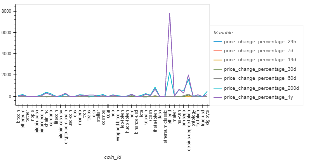
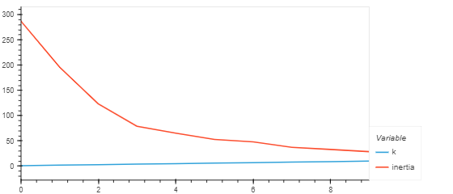
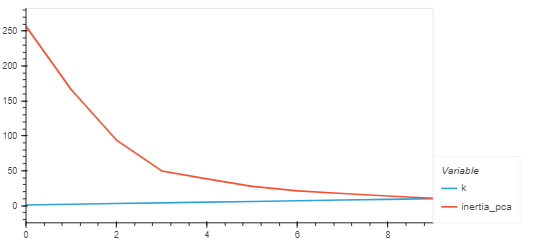
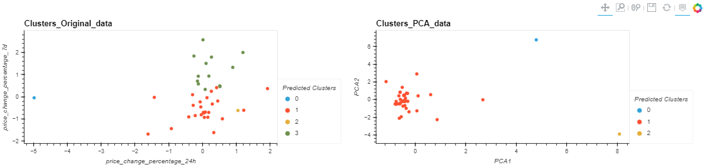

# Homework_week_10
****
#
## ** A financial analysis of historical data of multiple cryptocurrencies is performed using clustering methods. In this project, I have investigated the accuracy between two different pre-processing methods and had clear winner. I was successfully able to answer the following questions.**
#
## The original data plot is represented below:

## 1. Question: What is the best value for `k`??
##
## Elbow Curve obtained from original data

## Answer: The best value for k seems to be 4.
##
## 2. Question: What is the total explained variance of the three principal components?
## Answer: The total explained variance ratio is 0.895.
##

## 3. Question: What is the best value for `k` when using the PCA data?
## Answer: 3.
##
## 4. Question: Does it differ from the best k value found using the original data?
## Answer: Yes, the knee-point of the curve where it begins to flatten is more easily identified using the pca data.
##
## 5. Question: After visually analyzing the cluster analysis results, what is the impact of using fewer features to cluster the data using K-Means? 

## Answer: Using PCA technique for preprocessing the data has yielded an optimal k for number of clusters which in effect has provided a clearer representation of the variance among the cryptocurrencyies. Compared to the clustering plot obtained from analysing the original data, it was quite clear which cryptocurrencies have deviated the most and where they fall among each other. However, this on the other hand, makes it harder to analyze the deviations among the clusters which lie closely amongst each other. 

****